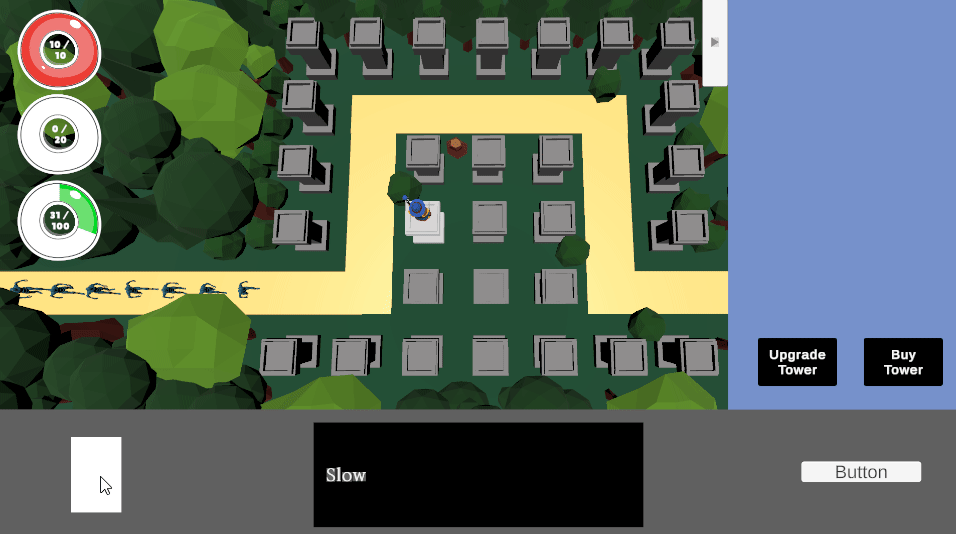

<h1> 🎮 Random Tower Card Defense 

 
  
마을을 침략하기 위해 스테이지 별로 몰려오는 몬스터들을 랜덤타워를 생성하여 물리치는 게임, Random Tower Card Defense 입니다!
 상황에 맞는 타워를 효율적인 위치에 배치하고 강화하며, 특별한 능력을 가진 카드를 사용하여 적들을 물리칠 수 있습니다.

 
## 목차
 - [개요](#개요)
 - [게임 설명](#게임설명)
 - [게임 플레이 방식](#게임플레이방식)
   
## 개요
- 프로젝트 이름 : Random Tower Card Defense
- 프로젝트 기간 : 2025.03 - 2025.04
- 개발 엔진 및 언어 : Unity & C#
- 개발 인원 : 1명(원광희)

## 게임설명

|  |
|:-------:|
| 플레이영상(썸네일 클릭시 유튜브 영상 재생) |

- 물리쳐라! ⚔️
   스테이지별로 마을을 침공하기 위해 몰려오는 적들을 물리쳐야 합니다. 에너지를 사용하여 적절한 위치에 타워를 소환, 강화할 수 있습니다. 전략적인 위치에 소환하고 강화하여 적들을 모두 물리치세요!
   

- 전략적으로 카드를 사용하라! 🧩
   플레이어는 타워를 통한 게임플레이 외에도 카드를 사용하여 추가적인 마법을 발동할 수 있습니다.  마나를 사용하여 전략적으로 게임의 흐름을 뒤집어 보세요!
   

- 초보자도 누구나! 👶
    간단한 조작으로 진행되기 때문에 누구나 쉽게 플레이 할 수 있습니다.  몇 번의 클릭으로 나만의 타워부대를 만들어보세요!
    

## 게임플레이방식

- 기본적으로 키보드는 사용하지 않으며 마우스 클릭만으로 진행
- 보스 라운드의 보스까지 모두 물리친 후 여분 체력이 남아있으면 승리!
- 보스를 물리치지 못하거나 체력이 모두 소진될 경우 패배!

- 타워 소환

|  |  |  |
|:---:|:---:|:---:|
| 타워프레임 클릭 | 타워 구매 클릭(에너지 소모) | 랜덤 타워 소환 |

- 타워 종류

|  |  |  |
|:---:|:---:|:---:|
| 아처타워 | 매직타워 | 캐논타워 |

- 카드 사용

|  |  |  |
|:---:|:---:|:---:|
| 카드생성 | 드래그 앤 드랍 | 카드적용(마나 소모) |

- 카드 종류

|  |  |
|:---:|:---:|
| 슬로우카드 | 데미지카드 |
